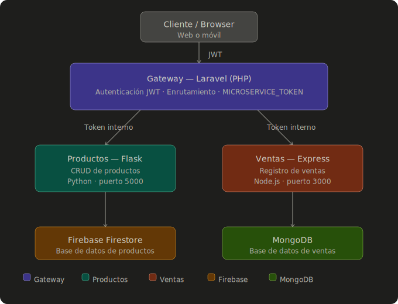
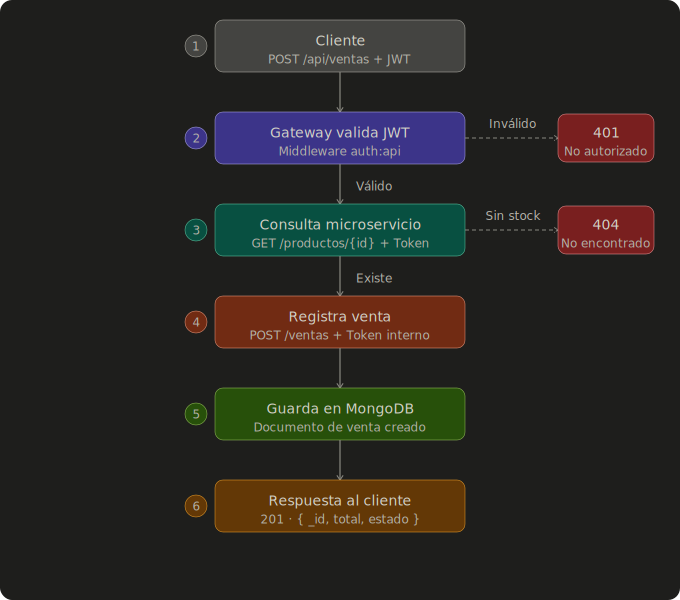

# Tienda — ShopISII

Sistema de comercio electrónico basado en **arquitectura de microservicios**, compuesto por tres servicios independientes que se comunican entre sí a través de un API Gateway con autenticación JWT.

---

## Arquitectura del sistema

```
┌─────────────────────────────────────────────────────────────┐
│                        CLIENTE / BROWSER                    │
└──────────────────────────┬──────────────────────────────────┘
                           │  HTTP (JWT)
                           ▼
┌─────────────────────────────────────────────────────────────┐
│              GATEWAY — Laravel (PHP)                        │
│  • Autenticación JWT de usuarios externos                   │
│  • Enrutamiento hacia microservicios internos               │
│  • Token compartido entre servicios (MICROSERVICE_TOKEN)    │
└───────────┬──────────────────────────┬──────────────────────┘
            │  HTTP + Token interno    │  HTTP + Token interno
            ▼                          ▼
┌──────────────────────┐   ┌──────────────────────────────────┐
│  PRODUCTOS — Flask   │   │      VENTAS — Express (Node.js)  │
│  (Python)            │   │                                  │
│  • CRUD de productos │   │  • Registro y consulta de ventas │
│  • Firebase Firestore│   │  • MongoDB como base de datos    │
└──────────────────────┘   └──────────────────────────────────┘
        │
        ▼
┌──────────────────────┐
│  Firebase Firestore  │
│  (Base de datos de   │
│   productos)         │
└──────────────────────┘
```



> El Gateway es el único punto de entrada para el cliente. Los microservicios de productos y ventas **no están expuestos directamente** — solo aceptan peticiones que vengan acompañadas del token interno (`MICROSERVICE_TOKEN`).

---

# FLUJO PARA CREAR UNA VENTA


Cliente
  │
  │  POST /api/ventas  (con JWT de usuario)
  ▼
Gateway (Laravel)
  │
  │  1. Valida el JWT del usuario
  │  2. Consulta al microservicio de Productos
  │     → GET http://api/productos/{id}
  │        (con MICROSERVICE_TOKEN en el header)
  │  3. Verifica que el producto exista y tenga stock
  │
  │  4. Llama al microservicio de Ventas
  │     → POST http://api/ventas
  │        (con MICROSERVICE_TOKEN en el header)
  │        (body: usuario, producto, cantidad, total)
  │
  ▼
Microservicio Ventas (Express)
  │
  │  Guarda el documento de venta en MongoDB
  │
  ▼
Respuesta al cliente: { venta_id, estado, total }




# Estructura del repositorio


ShopISII/
├── gateway/           # API Gateway — Laravel (PHP)
├── productos_flask/   # Microservicio de productos — Flask (Python)
├── ventas_express/    # Microservicio de ventas — Express (Node.js)
└── README.md


---

# Despliegue

Cada microservicio se configura y levanta de forma independiente. Se recomienda iniciar en este orden: **Productos → Ventas → Gateway**.


# 1. Microservicio de Productos — `productos_flask`

**Requisitos:** Python 3.10+, pip

# Instalación

```bash
cd productos_flask
pip install -r requirements.txt
```

#### Configuración del `.env`

Crea un archivo `.env` en la raíz de `productos_flask/` con el siguiente contenido:

```env
# Token compartido con el Gateway para validar peticiones internas
TOKEN=un_token_secreto_seguro

# Puerto donde correrá el servicio (ajusta si es necesario)
PORT=5000
```

#### Configurar Firebase

Este microservicio usa **Firebase Firestore** como base de datos. Para conectarlo:

1. Ve a la [Consola de Firebase](https://console.firebase.google.com/), selecciona tu proyecto y entra a **Configuración del proyecto → Cuentas de servicio**.
2. Haz clic en **"Generar nueva clave privada"** y descarga el archivo JSON.
3. Renómbralo como `serviceAccountKey.json` y colócalo en la raíz de `productos_flask/`.


#### Levantar el servicio

```bash
python app.py
```

El servicio estará disponible en `http://localhost:5000`.


# 2. Microservicio de Ventas — `ventas_express`

**Requisitos:** Node.js 18+, npm, instancia de MongoDB activa

#### Instalación

```bash
cd ventas_express
npm install
```

#### Configuración del `.env`

Crea un archivo `.env` en la raíz de `ventas_express/`:

```env
# Token compartido con el Gateway para validar peticiones internas
TOKEN=un_token_secreto_seguro

# URL de conexión a MongoDB (reemplaza con tu cadena de conexión real)
MONGO_URI=mongodb://localhost:27017/tienda

# Puerto donde correrá el servicio
PORT=3000
```

> El valor de `MICROSERVICE_TOKEN` debe ser **exactamente el mismo** que el configurado en el Gateway y en el microservicio de Productos.

# Levantar el servicio

```bash
node server.js

```

El servicio estará disponible en `http://localhost:3000`.

---

### 3. Gateway — `gateway`

**Requisitos:** PHP 8.1+, Composer

# Instalación

```bash
cd gateway
composer install
```

#### Configuración del `.env`

Copia el archivo de ejemplo y edítalo:

```bash
cp .env.example .env
```

Abre `.env` y configura los siguientes valores:

```env
APP_NAME=ShopISII
APP_ENV=local
APP_KEY=           # Se genera en el paso siguiente
APP_DEBUG=true
APP_URL=http://localhost:8000

# Firma para JWT — se genera con php artisan jwt:secret
JWT_SECRET=genera_este_valor_con_el_comando_de_abajo

# Token interno compartido con los microservicios
TOKEN=un_token_secreto_seguro

# URLs de los microservicios (ajusta host y puerto según tu entorno)
ENDPOINT_FLASK=http://localhost:5000/api/productos
ENDPOINT_FLASK_VALIDAR=http://localhost:5000/api/producto_validar
ENDPOINT_FLASK_RESTA=http://localhost:5000/api/stock_resta
ENDPOINT_EXPRESS=http://localhost:3000/api/ventas
ENDPOINT_EXPRESS_VENTAS=http://localhost:3000/api/ventas/usuario
```

#### Generar la firma JWT

Ejecuta el siguiente comando para generar automáticamente el valor de `JWT_SECRET` en tu `.env`:

```bash
php artisan jwt:secret
```

#### Generar la clave de aplicación

```bash
php artisan key:generate
```

#### Levantar el Gateway

```bash
php artisan serve
```

El Gateway estará disponible en `http://localhost:8000`.

---

# Variables de entorno — Resumen

| Variable | Servicio | Descripción |
|---|---|---|
| `JWT_SECRET` | Gateway | Firma para generar/validar JWT de usuarios. Generar con `php artisan jwt:secret` |
| `TOKEN` | Todos | Token compartido para comunicación interna entre servicios. Debe ser igual en los 3 |
| `ENDPOINT_FLASK` | Gateway | URL donde corre el microservicio de productos |
| `VENTAS_SERVICE_URL` | Gateway | URL donde corre el microservicio de ventas |
| `MONGO_URI` | Ventas | Cadena de conexión a MongoDB |


# Documentación de endpoints

Todos los endpoints se consumen a través del **Gateway** en `http://localhost:8000/api`. Los endpoints protegidos requieren el header:

Authorization: Bearer <token>
```

El token se obtiene al hacer login con `/api/login`.

---

# Autenticación

### `POST /api/register`
Registra un nuevo usuario en el sistema.

**Autenticación:** No requerida

**Body (JSON):**
```json
{
  "name": "Juan Pérez",
  "email": "juan@correo.com",
  "password": "contraseña123"
}
```

**Respuesta exitosa `201`:**
```json
{
  "message": "Usuario registrado correctamente",
  "user": {
    "id": 1,
    "name": "Juan Pérez",
    "email": "juan@correo.com"
  },
  "token": "eyJ0eXAiOiJKV1QiLCJhbGciOiJIUzI1NiJ9..."
}
```


#### `POST /api/login`
Inicia sesión y devuelve un token JWT.

**Autenticación:** No requerida

**Body (JSON):**
```json
{
  "email": "juan@correo.com",
  "password": "contraseña123"
}
```

**Respuesta exitosa `200`:**
```json
{
  "token": "eyJ0eXAiOiJKV1QiLCJhbGciOiJIUzI1NiJ9...",
  "token_type": "bearer",
  "expires_in": 3600
}
```


#### `POST /api/logout`
Invalida el token JWT del usuario autenticado.

**Autenticación:**  Requerida

**Respuesta exitosa `200`:**
```json
{
  "message": "Sesión cerrada correctamente"
}
```

---

## Productos

> Estos endpoints son manejados por el Gateway y redirigidos al microservicio **Flask** (`productos_flask`).

#### `GET /api/productos`
Retorna la lista de todos los productos disponibles.

**Autenticación:** Requerida

**Respuesta exitosa `200`:**
```json
[
  {
    "id": "abc123",
    "nombre": "Camiseta",
    "precio": 29900,
    "stock": 50
  }
]
```

### `POST /api/productos`
Crea un nuevo producto.

**Autenticación:** Requerida

**Body (JSON):**
```json
{
  "nombre": "Camiseta",
  "precio": 29900,
  "stock": 50
}
```

**Respuesta exitosa `201`:**
```json
{
  "message": "Producto creado correctamente",
  "id": "1"
}
```

---

#### `PUT /api/productos/{id}`
Actualiza los datos de un producto existente.

**Autenticación:** Requerida

**Parámetro de ruta:**
| Parámetro | Tipo   | Descripción |
|---|---|---|
| `id`      | string | ID del producto en Firebase |

**Body (JSON):** — Envía solo los campos que deseas actualizar.
```json
{
  "precio": 35000,
  "stock": 40
}
```

**Respuesta exitosa `200`:**
```json
{
  "message": "Producto actualizado correctamente"
}
```


##`DELETE /api/productos/{id}`
Elimina un producto por su ID.

**Autenticación:** Requerida

**Parámetro de ruta:**
| Parámetro | Tipo     Descripción |
|---|---|---|
| `id`      | string | ID del producto en Firebase |

**Respuesta exitosa `200`:**
```json
{
  "message": "Producto eliminado correctamente"
}
```

---

## Ventas

> Estos endpoints son manejados por el Gateway y redirigidos al microservicio **Express** (`ventas_express`).

#### `GET /api/ventas`
Retorna la lista de todas las ventas registradas.

**Autenticación:** Requerida

**Respuesta exitosa `200`:**
```json
[
  {
    "_id": "664f1a2b3c4d5e6f7a8b9c0d",
    "usuario_id": 1,
    "producto_id": "2",
    "cantidad": 2,
    "total": 59800,
  }
]
```

---

#### `POST /api/ventas`
Registra una nueva venta.

**Autenticación:**  Requerida

**Body (JSON):**
```json
{
  "producto_id": "2",
  "cantidad": 2,
  "total": 59800
}
```

**Respuesta exitosa `201`:**
```json
{
  "message": "Venta registrada correctamente",
  "_id": "664f1a2b3c4d5e6f7a8b9c0d"
}
```

---

#### `PUT /api/ventas/{id}`
Actualiza los datos de una venta existente.

**Autenticación:** Requerida

**Parámetro de ruta:**
| Parámetro | Tipo   | Descripción                       |
|---|---|---|
| `id`      | string | ID de la venta en MongoDB (`_id`) |

**Body (JSON):** — Envía solo los campos a actualizar.
```json
{
  "cantidad": 3,
  "total": 89700
}
```

**Respuesta exitosa `200`:**
```json
{
  "message": "Venta actualizada correctamente"
}
```


### `DELETE /api/ventas/{id}`
Elimina una venta por su ID.

**Autenticación:** Requerida

**Parámetro de ruta:**
| Parámetro | Tipo   | Descripción |
|---|---|---|
| `id`      | string | ID de la venta en MongoDB (`_id`) |

**Respuesta exitosa `200`:**
```json
{
  "message": "Venta eliminada correctamente"
}
```

---

## `POST /api/ventas_usuario`
Retorna todas las ventas asociadas a un usuario específico.

**Autenticación:** Requerida

**Body (JSON):**
```json
{
  "usuario_id": 1
}
```

**Respuesta exitosa `200`:**
```json
[
  {
    "_id": "664f1a2b3c4d5e6f7a8b9c0d",
    "usuario_id": 1,
    "producto_id": "356",
    "cantidad": 2,
    "total": 59800,
  }
]
```

---

###  Resumen de endpoints

| Método | Endpoint              | Descripción         |Auth |
|---|--- |---                    |---|
| `POST` | `/api/register`       | Registrar usuario   | ❌ |
| `POST` | `/api/login`          | Iniciar sesión      | ❌ |
| `POST` | `/api/logout`         | Cerrar sesión       | ✅ |
| `GET`  | `/api/productos`      | Listar productos    | ✅ |
| `POST` | `/api/productos`      | Crear producto      | ✅ |
| `PUT`  | `/api/productos/{id}` | Actualizar producto | ✅ |
|`DELETE`| `/api/productos/{id}` | Eliminar producto   | ✅ |
| `GET`  | `/api/ventas`         | Listar ventas       | ✅ |
| `POST` | `/api/ventas`         | Crear venta         | ✅ |
| `PUT`  | `/api/ventas/{id}`    | Actualizar venta    | ✅ |
|`DELETE`| `/api/ventas/{id}`    | Eliminar venta      | ✅ |
| `POST` | `/api/ventas_usuario` | Ventas por usuario  | ✅ |

---

# Tecnologías utilizadas

| Servicio | Tecnología         | Base de datos      |
|---       |---                 |---                 |
| Gateway  | Laravel (PHP)      | —                  |
| Productos| Flask (Python)     | Firebase Firestore |
| Ventas   | Express (Node.js)  | MongoDB            |

---

## Notas importantes

- Los tres servicios deben compartir el **mismo valor** de `TOKEN`.
- El archivo `serviceAccountKey.json` de Firebase debe generarse desde la consola de Firebase y nunca subirse al repositorio.
- El `JWT_SECRET` del Gateway se genera localmente con `php artisan jwt:secret` y no debe compartirse.
- Asegúrate de que los puertos no estén en conflicto si corres todo en la misma máquina (por defecto: Gateway `8000`, Ventas `3000`, Productos `5000`).